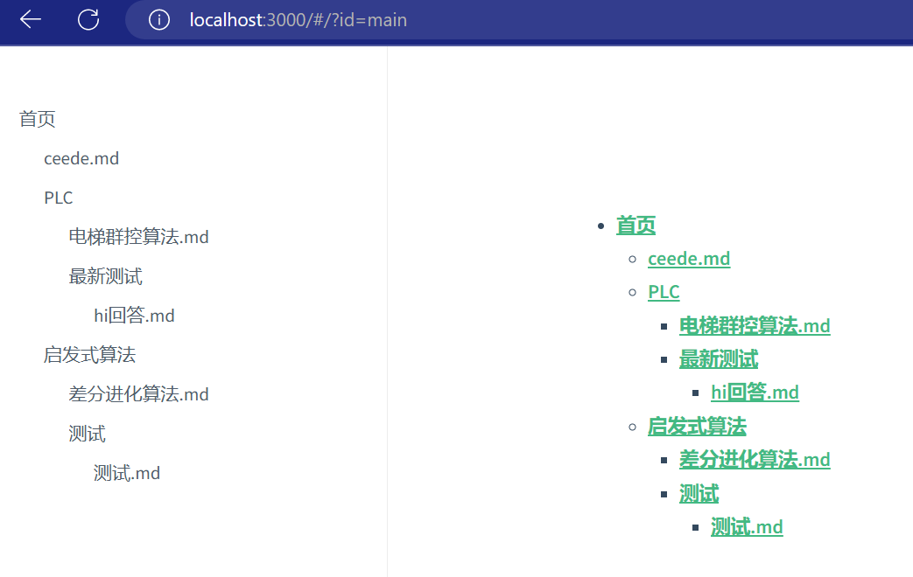
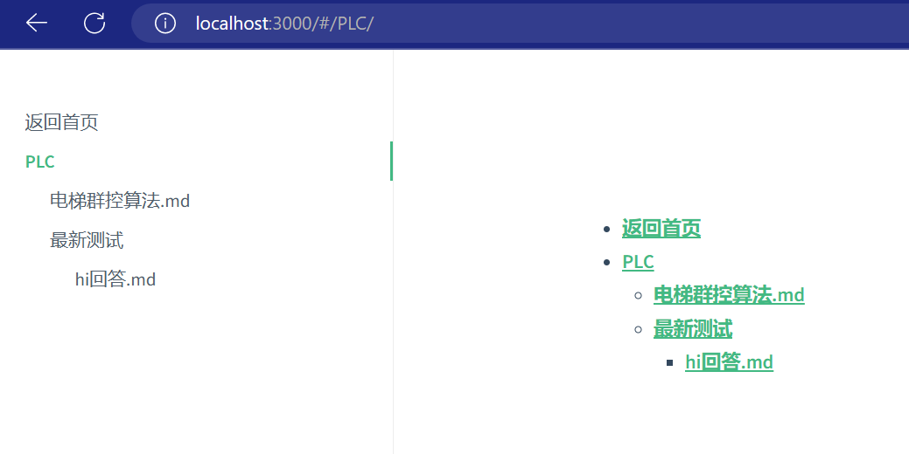
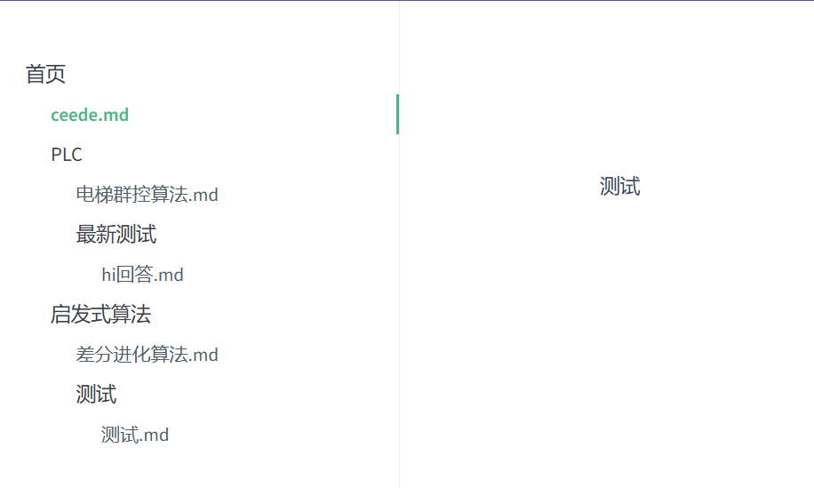
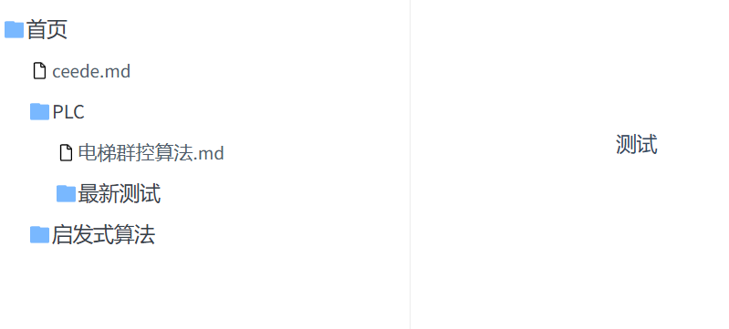
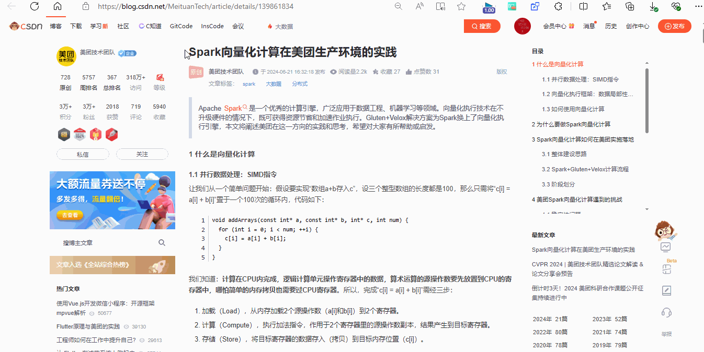
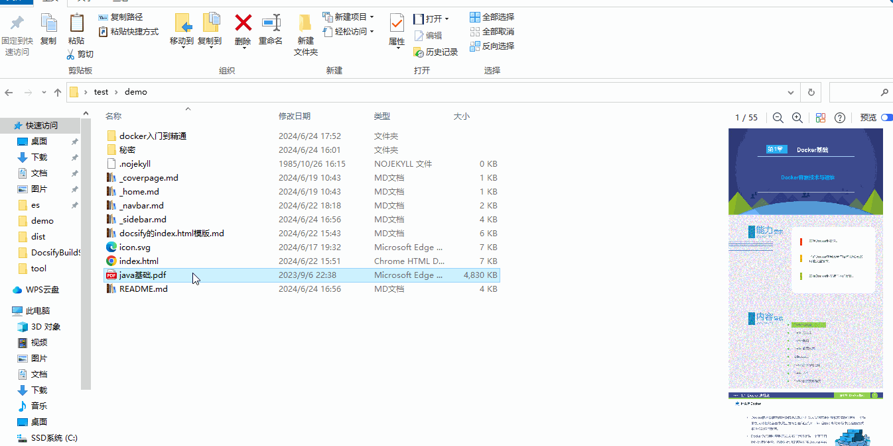
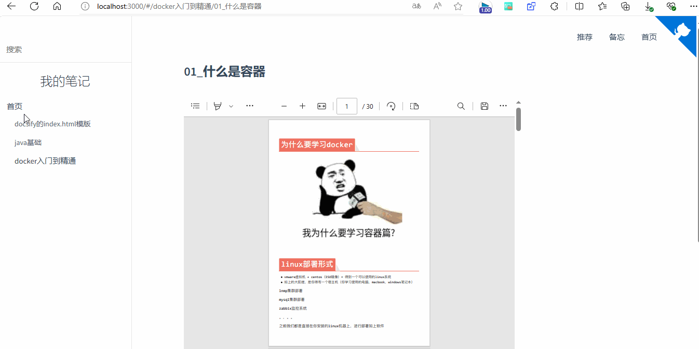

# docsify 侧边栏自动生成脚本

# docsify sidebar automatically generates scripts

> 打包成exe文件，程序大小约为5M，还是比较轻量的，主要文件有：
> 1. buildSidebar.exe -> 执行程序后在config.txt设置的根目录下文件夹生成READMD.md和_sidebar.md（名称可自定义）
> 2. config.txt -> 配置生成文件的一些输出文件\忽略情况等选项,具体可以看config.txt文件中注释(作者使用的是config.ini文件,exe读取不到ini,遂改为txt)

docsify好像没法自动读取文件夹目录结构并且展示在页面上,需要对每个文件夹配置_sidebar.md文件

所以我尝试用python做了一个脚本,基本就用到了os库中的一些函数,所以打包成exe文件大小在可以接受的范围里面,只有5M左右

该程序运行的配置参数依赖于config.txt,所以使用前请将config.txt和builSidebar.exe放在同一个目录下

在生成md文件结构时,有时想要**忽略一些文件**或者**"_"开头的文件夹**,可以通过config.txt配置

```txt
[config]
# docsify根目录
base_dir=C:\Users\Administrator\Desktop\test\demo
# 忽略以“_”,"."开头的文件，如果要添加新文件，用“|”分隔
ignore_start_with=_|.
# 只读取".md"格式问价，如果添加新格式，用“|”分隔
show_file=.md
# 要忽略的文件名，要添加新文件，用“|”分隔
ignore_file_name=README
# 是否展示文件的后缀名，空值默认不展示，填上任意字符表示展示，比如show_extension=1
show_extension=
#不展示的文件夹（文件下所有文件都不展示），多个文件夹用“|”分隔
ignore_dir_name=秘密

# pdf相关配置
# 为pdf生成对应的md文件：0不生成(没有pdf文件或者不需要)；1部分生成,配合updatedPdfFiles使用可只更新updatedPdfFiles配置的pdf,当你修改了某些pdf的md,不希望覆盖可使用；
# 2全部生成，会覆盖你之前所有pdf的md，配合ignore_pdf_filename使用可忽略指定的pdf不更新；
pdf_write_mode=0
# 需要更新的pdf列表，多个文件用“|”分隔，如 python基础.pdf|java基础.pdf，搭配pdf_write_mode=1使用
updated_pdf_files=python基础.pdf|java基础.pdf
# 不需要展示的pdf文件目录，比如"秘密"和""简历""目录里面的pdf，不想展示，多个目录用“|”，如  秘密|简历
ignore_pdf_dirname=秘密|简历
# 不需要展示的pdf文件，多个文件用“|”分割，如 个人简历.pdf|征信查询.pdf，搭配pdf_write_mode=2使用
ignore_pdf_filename=个人简历.pdf|征信查询.pdf

[outFile]
# 想要在几级目录生成文件,默认"-1"表示所有文件夹生成,"0"表示在根目录生成,可以配合侧边栏折叠插件使用
create_depth=0
# 每个文件夹下主页文件名称和侧边栏文件名,默认README.md和_sidebar.md文件，想生成其他名称可修改文字，或者添加用“|”分隔
eachFile=README.md|_sidebar.md
```

# 举例1

> 在每一个子文件夹下生成文件

原先文件夹的结构是

```
docs
│  .nojekyll
│  ceede.md
│  index.html
│  _coverpage.md
│  
├─PLC
│  │  电梯群控算法.md
│  │  
│  └─最新测试
│          hi回答.md
│          
├─_media
│      Pasted image 20230403194327.png
│      
└─启发式算法
    │  差分进化算法.md
    │  
    └─测试
            测试.md
```

我在config.txt设置忽略:
1. 以"_","."开头的文件
2. 忽略文件名为README的文件
3. 结构中只包括".md"开头的文件

运行程序得到的结构是

```
docs
│  .nojekyll
│  ceede.md
│  index.html
│  README.md
│  _coverpage.md
│  _sidebar.md
│  
├─PLC
│  │  README.md
│  │  _sidebar.md
│  │  电梯群控算法.md
│  │  
│  └─最新测试
│          hi回答.md
│          README.md
│          _sidebar.md
│          
├─_media
│      Pasted image 20230403194327.png
│      
└─启发式算法
    │  README.md
    │  _sidebar.md
    │  差分进化算法.md
    │  
    └─测试
            README.md
            _sidebar.md
            测试.md
```

可以看到_media没有被操作,也符合要求

## 图片

在根目录情况:


点击PLC之后



这种方式生成的结构,点击新文件夹会刷新界面,也可以接受

# 举例2

> 上面的格式中,点击相应文件夹实际上会跳转,如果不想跳转,可以设置config.txt文件的create_depth参数
> 
> 当参数为-1时候,则每个文件夹生成文件
> 
> 当参数为0时,仅在根目录生成

该功能配合侧边栏折叠效果更好

原先结构

```
docs
│  .nojekyll
│  ceede.md
│  index.html
│  _coverpage.md
│  
├─PLC
│  │  电梯群控算法.md
│  │  
│  └─最新测试
│          hi回答.md
│          
├─_media
│      Pasted image 20230403194327.png
│      
└─启发式算法
    │  差分进化算法.md
    │  
    └─测试
            测试.md
```

config.txt`create_depth`设为0

生成的新结构

```
docs
│  .nojekyll
│  ceede.md
│  index.html
│  README.md
│  _coverpage.md
│  _sidebar.md
│  
├─PLC
│  │  电梯群控算法.md
│  │  
│  └─最新测试
│          hi回答.md
│          
├─_media
│      Pasted image 20230403194327.png
│      
└─启发式算法
    │  差分进化算法.md
    │  
    └─测试
            测试.md
```

可以看到仅在根目录生成了文件

## 图片



配合侧边栏折叠插件:https://github.com/iPeng6/docsify-sidebar-collapse




## PDF文件自动转对应的MD
建议文件不要太大，比如几百页的书籍，就github那个网速，打开得多慢。这里推荐一个把网页保存为PDF的超便利方式：打印另存为PDF,以edge浏览器举例
，右键点打印或者快捷键 ctrl +p 即可把网页所选内容另存为pdf,可设置缩放比例，纸张大小等。如果想编辑PDF,可以下载相关的软件。


###  PDF文件生成对应的MD文件前目录


###  PDF文件生成对应的MD文件后目录

### 页面效果
隐藏侧边栏，点侧边栏左下角三条横杆那个按钮，还有不设置右侧目录栏，pdf的阅读体验更好。


以上PDF是内嵌在页面展示的，如果要把PDF设置成默认全屏展示可以在index.html覆盖pdf内嵌样式，加上下面css代码。
```html
 <style>
        /* 全屏展示 PDF,如果不需要全屏展示，把整个style标签去掉 */
        .pdfobject-container {
            position: fixed;
            left: 0;
            top: 0;
            right: 0;
            bottom: 0;
            height: 100%;
            width: 100%;
            background: transparent;
            z-index: 100;
        }

        .pdfobject {
            border: none;
            height: 100%;
            width: 100%;
        }
</style>
``` 
